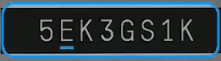

[](https://img.shields.io/badge/Swift_Package_Manager-compatible-orange)

     _____         _ _         
    |  _  |___ _ _| |_|___ ___ 
    |     |   | | | | |   | -_|
    |__|__|_|_|_  |_|_|_|_|___|
              |___|            

# Anyline Examples App 

[Anyline](https://www.anyline.com) is a mobile OCR SDK, which you can configure to scan various kinds of numbers, characters, text and codes.

The **Example App** provides many preconfigured modules to showcase the many capabilities of the Anyline SDK.

## Release notes

### Current release notes

You can find the latest release notes in our online documentation: https://documentation.anyline.com/ios-sdk-component/latest/release-notes.html

### Current known-limitations

A list of the currently known-limitations can be found [here](https://documentation.anyline.com/ios-sdk-component/latest/known-issues-and-limitations.html).

## Quick Start Guide

### 0. Clone or Download

If you'd like to clone the repository you will have to use [git-lfs](https://git-lfs.github.com/). Use the following commands to install git-lfs:

```
brew install git-lfs
git lfs install
```

If you prefer downloading a package, use the provided `zip` package on the [Releases page](https://github.com/Anyline/anyline-ocr-examples-ios/releases). Please note that Github's "Download ZIP" button does not work for projects with `git-lfs`.

### 1. With Cocoapods

Simply add `pod 'Anyline'` to your Podfile and run `pod install` or `pod update`. (Please make sure you are on the latest version of CocoaPods.)

You’re all done and can jump to point 3 (Set Linker Flags).

#### 1.1 Or via local copy of the Anyline.xcframework & AnylineResources.bundle

Simply drag & drop Anyline.xcframework & AnylineResources.bundle into your project tree. 


In the import screen select Copy items if needed and Create groups and add the files to your target.


#### 1.2 Or via Swift Package Manager (SwiftPM)

Starting with version 40, we are officially supporting Swift Package Manager (Xcode 11 or later required).

To use, click on File > Swift Packages > Add Package Dependency, and enter https://github.com/Anyline/anyline-ocr-spm-module.git in the search box.

If you are a framework author relying on Anyline SDK as a dependency, edit your Package.swift to add the dependency as follows:

```
dependencies: [
    .package(url: "https://github.com/Anyline/anyline-ocr-spm-module.git", .upToNextMajor(from: "40.0.0"))
]
```

Please make sure that the URL is https://github.com/Anyline/anyline-ocr-spm-module.git, instead of https://github.com/Anyline/anyline-ocr-examples-ios.git.


### 2. Link and embed Anyline.xcframework

Go to your project inspector and open the **Build Phases** tab. First, add the following libraries to **Link Binary With Libraries**:

- libc++.tbd
- libz.tbd

Next, locate the **Embed Frameworks** build phase and drag Anyline.xcframework from the project navigator into it. Ensure that "Code Sign on Copy" is checked. (If no **Embed Frameworks** build phase is found, add a **Copy Files** phase to the target and set **Destination** to "Frameworks".) 

After adding the libraries, the Build Phases tab for the app target should look like this: 


### 3. Set Linker Flags

In your project inspector, switch to the **Build Settings** tab and search for **Other Linker Flags**. Select "Other > Other Linker Flags" and add `-ObjC`. This flag causes the linker to load every object file in the library that defines an Objective-C class or category.


#### 3.1 Bitcode

To use Anyline, Bitcode needs to be disabled. Simply set the **Enable Bitcode** build setting to **No**.


[Apple Documentation on Bitcode](https://developer.apple.com/library/ios/documentation/IDEs/Conceptual/AppDistributionGuide/AppThinning/AppThinning.html)

### 4. Create a ScanView on your ViewController or Storyboard

Now you need to create and configure a scan plugin to your needs, and set it to a scan view on a view hierarchy of your choice. A quick example can be found in https://documentation.anyline.com/ios-sdk-component/latest/the-anyline-sdk.html.

Each scan plugin can be configured to suit nearly every possible scenario you can think of, so please make sure to check out our documentation page on [Plugins](https://documentation.anyline.com/ios-sdk-component/latest/plugin-configuration.html) to find more detailed information. 

### 5. Enjoy scanning and have fun! :movie_camera:


## Sample Codes & Documentation 

Try and run our code examples here: [Anyline Examples](https://github.com/Anyline/anyline-ocr-examples-ios/tree/master/AnylineExamples)

Detailed information about how to configure and implement Anyline: [Documentation](https://documentation.anyline.com/ios-sdk-component/latest/index.html)

**IMPORTANT**: Before running the example app, replace the string defined in `kDemoAppLicenseKey` (in ALAppDemoLicenses.h) _with a valid license key_. To find out how to obtain a license key, see [License](#license).

## Get Help (Support)

We don't actively monitor the Github Issues, so please raise a support request using the [Anyline Helpdesk](https://anyline.atlassian.net/servicedesk/customer/portal/2/group/6).

When raising a support request based on this Github Issue, please fill out and include the following information:

```
Support request concerning Anyline Github Repository: anyline-ocr-examples-ios
```

Thank you!

## License 

To claim a free developer / trial license, go to: [Anyline SDK Register Form](https://anyline.com/free-demos/)

For further details, see LICENSE file.

# KITT <3


